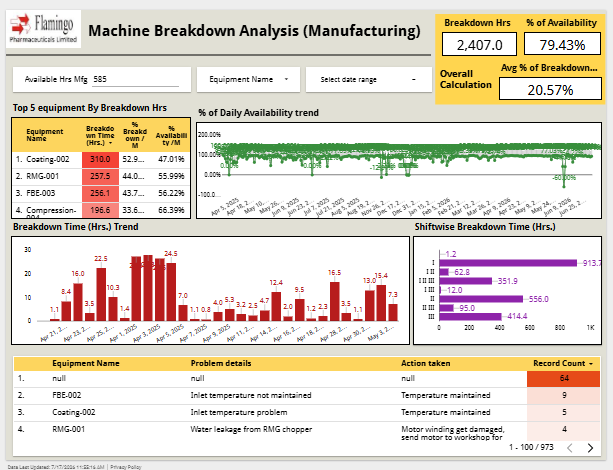
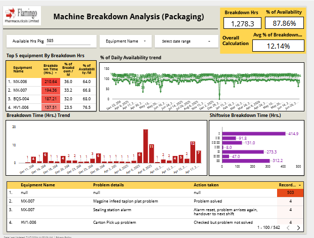

# Machine-Breakdown-Analytics

## Project Overview

An interactive machine breakdown dashboard developed in **Looker Studio** to monitor equipment performance across **Manufacturing (MFG)** and **Packaging (PKG)** operations. The dashboard enables maintenance and production teams to monitor machine downtime, equipment availability, recurring breakdowns, and corrective actions using regularly updated operational data.

> **Note:** The dashboard is designed to support daily maintenance monitoring by providing detailed operational insights for Manufacturing (MFG) and Packaging (PKG) machines.

## Business Objective

- Monitor machine breakdowns across Manufacturing (MFG) and Packaging (PKG).
- Track equipment downtime and machine availability.
- Identify machines with frequent breakdowns.
- Analyze recurring equipment failures and corrective actions.
- Compare breakdown performance across production shifts.
- Support preventive maintenance and improve operational efficiency.

## Dataset

The dashboard is built using regularly updated machine breakdown data containing breakdown date, production shift, equipment name, problem details, corrective actions, downtime, breakdown percentage, and machine availability information.

## Tools Used

- Looker Studio
- Google Sheet

## Dashboard Pages

- Manufacturing (MFG) Analysis
- Packaging (PKG) Analysis

## Key Performance Indicators (KPIs)

- Total Breakdown Hours
- Total Breakdown Count
- MTBF (Mean Time Between Failures)
- Machine Availability (%)
- Average Downtime

## Live Dashboard

👉 **[View Interactive Dashboard](https://datastudio.google.com/s/h43W7-uar4Y)**

## Dashboard Pages

### Manufacturing (MFG) Analysis

### Packaging (PKG) Analysis

